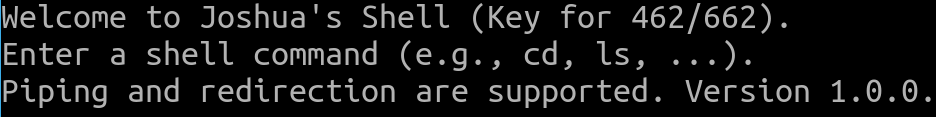
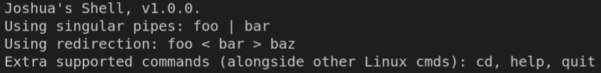

# Assignment 3 (with extra credit): Simple Shell Extention

***Note:*** *This is the last programming assignment for the class. It contains a required section, and an extra credit component. The extra credit component is worth 20 extra points in your assignment grade. That accounts for 2 points for undegraduates and 1.73 points for grad students in the final grade.*

***Note 2:*** *As part of your submission, you will edit this README.md file. All occurrences of [text like this] needs to be replaced by your edits. find markdown reference [here](https://www.w3schools.io/file/github-readme-image/).*

In this assignment, you will implement changing directories, redirection, and pipes. You will also make the shell a little bit more pleasant to use. 

## Submitter Information

Name: *[enter your full name]*

UNCG login ID: *[enter your UNCG login ID]*

Honor Pledge: *[enter your honor pledge. Find sample honor pledge text [here](https://uncg.instructure.com/courses/122861/pages/sample-honor-pledge).]*

**Here are the tasks to get you started.**

## Part 1: Required Tasks

### 0\. **Style and Robustness (25pts).**

1\. Keep your code structured, organized, and well-documented. This will help you later on (in life and in this class)!

2\. There should be no memory leaks of _any_ kind in your shell. Use [Valgrind](https://valgrind.org/)! If you quit the program using an interrupt signal via CTRL+C, you'll receive _one_ process-terminating message in Valgrind. Otherwise, it should be a clean Valgrind run.

3\. Gracefully handle errors. That is, check return values for `NULL`, negative values from `fork(), execvp(), pipe()`...

### 1\. **Improving the UI (25pts).** There are two components to this:

    1a. Create a "greeting" message that is displayed to the user when the shell starts. For an example, here is Joshua's (yours should, obviously, not look exactly like this): 

    1b. Create a function execute\_help() that displays a small help message explaining the basics of the shell when the user types "help". For an example, here is Joshua's:

2\. **Displaying the Current Directory.** Use `getcwd(...)` to print the current directory before the shell prompt. When you change directories, this should be updated accordingly (meaning it should be called for every iteration in your "read" loop). Here is what Joshua's looks like (yours should look very similar if not identical):

3\. **Redirection (25pts)**. Redirection extracts the output of one program/command and passes it to another. For instance, `who > users` executes the `who` command and stores its output in the file `users`. You do not have to support the append `>>` redirection operator. Redirection works the other way as well; for instance, `wc -l < users` runs the command `wc -l` on the contents of `users`.  The way you implement this is ultimately up to you, but here is the general idea:

    3a. You first need to determine where you are redirecting input from and where you are redirecting output to. So, you should write two functions: `bool redirect_input(const size_t num_args, char *args[], char **input_file);`, and `bool redirect_output(const size_t num_args, char *args[], char **output_file);`. Iterate over your arguments array, and if you find the redirection symbol (< for input, > for output), free that index, and copy the data from its index + 1 into the `char**` parameter. The idea is that, if you enter a command `foo < bar`, `bar` is copied into `input_file`. That way, you can use it outside of this function. Your job, however, isn't done yet! You need to shift all arguments over by a factor of two to account for not using the redirection symbol argument or the argument immediately after. Then, simply return true (the return value is to let the caller know if the command uses redirection).

    3b. In the caller (i.e., `execute_cmd`), when `redirect_input` returns true, you should use the `freopen` command and pass the input/output `char **`, the appropriate file mode (i.e., read or write), and either `stdin` or `stdout`.

    3c. Finally, you can call `execvp` as normal.

4\. **Pipes (25pts).** Implement pipes. You only need to support one pipe per command. You do not have to support redirection and pipes in the same command. This step is the hardest step to get right, and requires some very careful code and planning. If you get stuck, follow these steps.

    4a. You should first write a function, say, `int find_pipe_idx(const size_t num_args, char *args[]);` which returns the index of the argument that contains a pipe, or -1 if there is no pipe.

    4b. Now, write a function `execute_pipe(int pipe_idx, char *args[]);`. Your program will create two child processes, and execute the left-hand side of the pipe in one, and the right-hand side of the pipe in another. So, you should create two `char **` arrays to store the arguments for each command. For example, if I enter `ls -l -a -t | wc -l`, There should be an array (we'll call it `lhs`) with elements `lhs[0] = "ls", lhs[1] = "-l", lhs[2] = "-a", lhs[3] = "-t", lhs[4] = NULL`, and another array (we'll call it `rhs`) with elements `rhs[0] = "wc", rhs[1] = "-l", rhs[2] = NULL`. Creating the offsets and correctly allocating/copying arguments over is tricky but the code should be short and concise, so don't overcomplicate it!

    4c. To connect the two processes so the left-hand side can communicate with the right-hand side, we need to use the `pipe` C function. One end of the pipe will be for reading, and the other will be for writing. `pipe()` takes in a two-element `int` array and allocates index 0 to be the write end, and index 1 to be the read end (read the book and see course notes for details). Make sure to check for errors when calling the function!

    4d. Now, you need to actually create the two child processes! Create a child `p1` with `fork()`, as you normally would. Inside this child, you will close one end of the pipe via the `close()` function, duplicate the end you are using via `dup2()`, and then close the other end of the pipe. Namely, `close(fd[1])`, `dup2(fd[0], 0)`, `close(fd[0])`. Finally, you will call `execvp` and pass `lhs[0]`, `lhs`. In other words, this child will execute the left-hand side of the pipe, reading its data from the standard input file descriptor while the right-hand side writes to the standard output file descriptor. 

    4e. The right-hand side requires another call to `fork()`. In step 5d, you made a call to `fork()`, meaning you should have an `if/else-if/else` statement. Inside the `else` (i.e., if the process is the parent) statement, create another `fork()` invocation, and do the same thing as in step 5d, with the exception that you should be closing and dup-ing the opposite file descriptors. 

    4f. Inside _that_ `if/else-if/else`, inside the "`else`" block, you need to close both file descriptors in the parent (i.e., `close(fd[0])`, `close(fd[1])`, and call `wait(NULL)` twice. This ensures that the parent does not block its children from reading and writing to and from each other.

    4g. Depending on how you set this up, you'll almost certainly have to `free` the arrays that you created in step 5b. Do _not_ free the elements themselves! Rather, _only_ free the two pointers.

5\. **Testing.** Here are some test cases:

*   `ls -l -a -t | wc -l`
*   `echo "hi there, how are you doing?" > out.o`
*   `wc -c < out.o > out2.o`
*   `cat main.c | wc -l`

**Other Helpful Information:**

1\. Implement one subsystem and function at a time! Don't try to do everything at once or you'll quickly get frustrated. Each step in the assignment is building on the level of difficulty, so complete each step in order before moving to the next one.

2\. Your shell should be, in a sense, a circular evaluator. This means that if you run the same program that you initially executed to start the shell, it should spawn another shell nested inside. You won't notice a difference until you type "quit". So, try and spawn five shells one after another, then type "quit" six times. This should end the program altogether.

3\. Don't try and write more code than you need! My solution (including comments and all .c and .h files) has slightly under 400 lines of code. If you start going too far above this, you're probably doing something wrong.

4\. Nested commands via &&, suspended processes, multiple pipes, and > 2 redirections in the same command do not have to be supported.

## Part 2: Extra Credit (20pts)

**Changing Directories.** Implement `execute_cd(const char *dir);`. Note that the reason it's ever so slightly harder to implement the change directory command compared to others is that this command may only be executed in the parent process. Hint: use `chdir()`.

**Testing.** Here are some test cases:

*   `cd ../`
*   `cd ~`
*   `cd /home`
*   `cd ../../../`

***Note:*** *You may not get partial credits for the extra credit. You will either get full (20pts) credit, or zero.*

